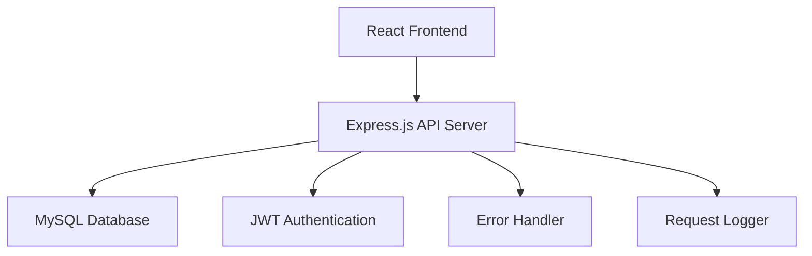

# Design Document: Simplified Backend API

## Overview

Thiết kế một REST API backend đơn giản sử dụng Express.js để kết nối frontend React với MySQL database. Backend được tối ưu hóa cho sự đơn giản, dễ hiểu và dễ bảo trì, phù hợp với quy mô dự án học tập.

## Architecture

### High-Level Architecture



### Technology Stack

- **Runtime**: Node.js (ES Modules)
- **Framework**: Express.js 4.x
- **Database**: MySQL với mysql2/promise
- **Authentication**: JWT (jsonwebtoken)
- **Validation**: express-validator
- **Security**: bcryptjs, cors, helmet
- **Logging**: Simple console logging

## Components and Interfaces

### 1. Server Structure

```
server/
├── app.js              # Main Express app
├── server.js           # Server startup
├── config/
│   ├── db.js          # Database connection (existing)
│   └── auth.js        # JWT configuration
├── middleware/
│   ├── auth.js        # Authentication middleware
│   ├── validation.js  # Input validation
│   └── errorHandler.js # Error handling
├── routes/
│   ├── auth.js        # Login/logout routes
│   ├── customers.js   # Customer CRUD
│   ├── vehicles.js    # Vehicle management
│   ├── repairs.js     # Repair tickets
│   └── inventory.js   # Parts inventory
└── utils/
    ├── database.js    # Database helper functions
    └── response.js    # Standard response format
```

### 2. API Endpoints Design

#### Authentication Routes (`/api/auth`)
```javascript
POST /api/auth/login
// Body: { username, password }
// Response: { token, user: { id, username, role } }

POST /api/auth/logout
// Headers: Authorization: Bearer <token>
// Response: { message: "Logged out successfully" }
```

#### Customer Routes (`/api/customers`)
```javascript
GET /api/customers
// Query: ?search=<term>&page=<num>&limit=<num>
// Response: { customers: [...], total, page, limit }

POST /api/customers
// Body: { TenKH, DienThoai, DiaChi }
// Response: { customer: {...}, message }

PUT /api/customers/:id
// Body: { TenKH, DienThoai, DiaChi }
// Response: { customer: {...}, message }

DELETE /api/customers/:id  // Admin only
// Response: { message }
```

#### Vehicle Routes (`/api/vehicles`)
```javascript
GET /api/vehicles
// Query: ?customerId=<id>&status=<0|1>
// Response: { vehicles: [...] } // Includes customer info

POST /api/vehicles
// Body: { BienSo, MaHX, MaKH, NgayTiepNhan }
// Response: { vehicle: {...}, message }

PUT /api/vehicles/:bienso
// Body: { TrangThai, MaHX }
// Response: { vehicle: {...}, message }
```

#### Repair Routes (`/api/repairs`)
```javascript
GET /api/repairs
// Query: ?status=<pending|completed>&vehicleId=<bienso>
// Response: { repairs: [...] } // Includes vehicle & customer info

POST /api/repairs
// Body: { BienSo, MaKH, services: [...], parts: [...] }
// Response: { repair: {...}, message }

PUT /api/repairs/:id
// Body: { TrangThai, services: [...], parts: [...] }
// Response: { repair: {...}, message }
```

#### Inventory Routes (`/api/inventory`)
```javascript
GET /api/inventory
// Query: ?lowStock=true&search=<term>
// Response: { parts: [...], lowStockCount }

POST /api/inventory  // Admin only
// Body: { TenVatTuPhuTung, SoLuong, DonGia }
// Response: { part: {...}, message }

PUT /api/inventory/:id
// Body: { TenVatTuPhuTung, SoLuong, DonGia }
// Response: { part: {...}, message }
```

### 3. Database Layer

#### Database Helper Functions
```javascript
// utils/database.js
export const executeQuery = async (query, params = [])
export const executeTransaction = async (queries)
export const findById = async (table, id, idColumn = 'id')
export const findAll = async (table, conditions = {})
export const insertRecord = async (table, data)
export const updateRecord = async (table, id, data, idColumn = 'id')
export const deleteRecord = async (table, id, idColumn = 'id')
```

#### Query Examples
```sql
-- Get customers with search
SELECT * FROM KHACHHANG 
WHERE TenKH LIKE ? OR DienThoai LIKE ? 
ORDER BY TenKH 
LIMIT ? OFFSET ?

-- Get vehicles with customer info
SELECT v.*, k.TenKH, h.TenHieuXe 
FROM XE v
JOIN KHACHHANG k ON v.MaKH = k.MaKH
JOIN HIEUXE h ON v.MaHX = h.MaHX
WHERE v.TrangThai = ?

-- Get repair details
SELECT p.*, v.BienSo, k.TenKH, k.DienThoai
FROM PHIEUSUACHUA p
JOIN XE v ON p.BienSo = v.BienSo
JOIN KHACHHANG k ON p.MaKH = k.MaKH
ORDER BY p.MaPhieuSuaChua DESC
```

## Data Models

### Request/Response Models

#### Standard Response Format
```javascript
{
  success: boolean,
  data: any,
  message: string,
  error?: string,
  pagination?: {
    page: number,
    limit: number,
    total: number,
    totalPages: number
  }
}
```

#### Customer Model
```javascript
{
  MaKH: number,
  TenKH: string,
  DienThoai: string,
  DiaChi: string,
  TienNo: number
}
```

#### Vehicle Model
```javascript
{
  BienSo: string,
  MaHX: number,
  MaKH: number,
  NgayTiepNhan: string, // ISO date
  TrangThai: number, // 0: completed, 1: in progress
  TenKH?: string, // Joined from KHACHHANG
  TenHieuXe?: string // Joined from HIEUXE
}
```

#### Repair Model
```javascript
{
  MaPhieuSuaChua: number,
  BienSo: string,
  MaKH: number,
  TienCong: number,
  TienPhuTung: number,
  TongTien: number,
  NgayTao: string, // ISO date
  TrangThai: string, // 'pending', 'in_progress', 'completed'
  services: [
    { MaTC: number, TenTienCong: string, ChiPhi: number }
  ],
  parts: [
    { MaPhuTung: number, TenVatTuPhuTung: string, SoLuong: number, DonGia: number }
  ]
}
```

## Correctness Properties

*A property is a characteristic or behavior that should hold true across all valid executions of a system-essentially, a formal statement about what the system should do. Properties serve as the bridge between human-readable specifications and machine-verifiable correctness guarantees.*

### Property 1: JSON Response Format Consistency
*For any* API endpoint, all responses should follow the standard JSON format with success, data, and message fields
**Validates: Requirements 1.3, 7.5**

### Property 2: JWT Token Verification
*For any* protected route, requests with invalid or missing JWT tokens should be rejected with 401 status
**Validates: Requirements 2.2**

### Property 3: Role-Based Authorization
*For any* admin-only endpoint, requests from staff users should be rejected with 403 status
**Validates: Requirements 2.5, 3.4**

### Property 4: User Role Extraction
*For any* valid JWT token, the authentication middleware should correctly extract and provide the user role
**Validates: Requirements 2.4**

### Property 5: Customer Data Validation
*For any* customer creation or update operation, invalid data should be rejected with 400 status and specific error messages
**Validates: Requirements 3.5, 7.1**

### Property 6: Customer CRUD Operations
*For any* valid customer data, POST operations should create new records and PUT operations should update existing records
**Validates: Requirements 3.2, 3.3**

### Property 7: Vehicle Creation with Referential Integrity
*For any* vehicle creation request, vehicles should only be created when linked to existing customers
**Validates: Requirements 4.5**

### Property 8: Vehicle Data Management
*For any* valid vehicle data, POST operations should register new vehicles and PUT operations should update vehicle status
**Validates: Requirements 4.2, 4.3**

### Property 9: License Plate Format Validation
*For any* vehicle registration, invalid license plate formats should be rejected before database operations
**Validates: Requirements 4.4**

### Property 10: Repair Cost Calculation
*For any* repair ticket creation, the total cost should be automatically calculated from services and parts
**Validates: Requirements 5.4**

### Property 11: Inventory Update on Parts Usage
*For any* repair that uses parts, the inventory quantities should be reduced accordingly
**Validates: Requirements 5.5**

### Property 12: Repair Ticket Management
*For any* valid repair data, POST operations should create tickets and PUT operations should update repair status
**Validates: Requirements 5.2, 5.3**

### Property 13: Inventory Stock Management
*For any* inventory operation, stock levels should never be allowed to go below zero
**Validates: Requirements 6.4**

### Property 14: Inventory CRUD Operations
*For any* valid inventory data, POST operations should add new parts and PUT operations should update part information
**Validates: Requirements 6.2, 6.3**

### Property 15: Low Stock Warning System
*For any* inventory query, responses should include warnings when stock levels are low
**Validates: Requirements 6.5**

### Property 16: Error Status Code Consistency
*For any* error condition, the API should return appropriate HTTP status codes (400 for validation, 404 for not found, 500 for server errors)
**Validates: Requirements 7.1, 7.2, 7.3**

### Property 17: Database Transaction Atomicity
*For any* multi-step operation, all database changes should be committed together or rolled back together
**Validates: Requirements 8.2**

### Property 18: SQL Injection Prevention
*For any* user input, SQL injection attempts should be prevented through proper input sanitization
**Validates: Requirements 8.3**

### Property 19: Database Connection Resilience
*For any* database connection failure, the API should attempt to reconnect automatically
**Validates: Requirements 8.4**

## Error Handling

### Error Response Format
All errors follow the standard response format:
```javascript
{
  success: false,
  data: null,
  message: "User-friendly error message",
  error: "Technical error details (development only)"
}
```

### Error Categories
1. **Validation Errors (400)**: Invalid input data
2. **Authentication Errors (401)**: Missing or invalid tokens
3. **Authorization Errors (403)**: Insufficient permissions
4. **Not Found Errors (404)**: Resource doesn't exist
5. **Server Errors (500)**: Database or system failures

### Error Handling Middleware
```javascript
// middleware/errorHandler.js
export const errorHandler = (err, req, res, next) => {
  // Log error for debugging
  console.error(`Error: ${err.message}`, err.stack);
  
  // Determine error type and response
  if (err.name === 'ValidationError') {
    return res.status(400).json({
      success: false,
      data: null,
      message: 'Dữ liệu không hợp lệ',
      error: err.message
    });
  }
  
  // Default server error
  res.status(500).json({
    success: false,
    data: null,
    message: 'Lỗi hệ thống, vui lòng thử lại sau',
    error: process.env.NODE_ENV === 'development' ? err.message : undefined
  });
};
```

## Testing Strategy

### Dual Testing Approach
- **Unit Tests**: Verify specific functions, middleware, and database operations
- **Property Tests**: Verify universal properties across all inputs and scenarios
- Both approaches are complementary and necessary for comprehensive coverage

### Unit Testing Focus
- Authentication middleware functionality
- Database helper functions
- Input validation logic
- Error handling scenarios
- Specific endpoint behaviors

### Property-Based Testing Focus
- API response format consistency across all endpoints
- Authentication and authorization rules for all protected routes
- Data validation rules for all input scenarios
- Database integrity constraints across all operations
- Error handling consistency across all failure modes

### Testing Configuration
- Minimum 100 iterations per property test
- Each property test references its design document property
- Tag format: **Feature: simplified-backend, Property {number}: {property_text}**
- Use test database for all database-related tests
- Mock external dependencies for isolated testing
