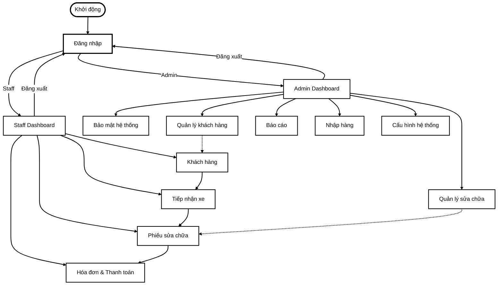

# Sơ Đồ Liên Kết Màn Hình - Đơn Giản

```mermaid
%%{init: {'theme':'base', 'themeVariables': {'primaryColor': '#ffffff', 'primaryTextColor': '#000000', 'primaryBorderColor': '#000000', 'lineColor': '#000000', 'secondaryColor': '#ffffff', 'tertiaryColor': '#ffffff', 'background': '#ffffff', 'mainBkg': '#ffffff', 'secondBkg': '#ffffff', 'tertiaryBkg': '#ffffff'}}}%%
flowchart TD
    Start([Khởi động]) --> Login[Đăng nhập]
    
    Login --> |Admin| AdminDash[Admin Dashboard]
    Login --> |Staff| StaffDash[Staff Dashboard]
    
    %% Admin Section
    AdminDash --> Security[Bảo mật hệ thống]
    AdminDash --> AdminCustomers[Quản lý khách hàng]
    AdminDash --> AdminRepairs[Quản lý sửa chữa]
    AdminDash --> Reports[Báo cáo]
    AdminDash --> Import[Nhập hàng]
    AdminDash --> Settings[Cấu hình hệ thống]
    
    %% Staff Section
    StaffDash --> Customers[Khách hàng]
    StaffDash --> Vehicles[Tiếp nhận xe]
    StaffDash --> Repairs[Phiếu sửa chữa]
    StaffDash --> Invoices[Hóa đơn & Thanh toán]
    
    %% Logout
    AdminDash --> |Đăng xuất| Login
    StaffDash --> |Đăng xuất| Login
    
    %% Data Flow
    Customers --> Vehicles
    Vehicles --> Repairs
    Repairs --> Invoices
    
    %% Admin Supervision
    AdminCustomers -.-> Customers
    AdminRepairs -.-> Repairs
    
    %% Styling - White background, black text, black arrows
    classDef default fill:#ffffff,stroke:#000000,stroke-width:2px,color:#000000
    classDef loginStyle fill:#ffffff,stroke:#000000,stroke-width:3px,color:#000000
    classDef adminStyle fill:#ffffff,stroke:#000000,stroke-width:2px,color:#000000
    classDef staffStyle fill:#ffffff,stroke:#000000,stroke-width:2px,color:#000000
    
    class Start,Login loginStyle
    class AdminDash,Security,AdminCustomers,AdminRepairs,Reports,Import,Settings adminStyle
    class StaffDash,Customers,Vehicles,Repairs,Invoices staffStyle
    
    %% Force black arrows
    linkStyle default stroke:#000000,stroke-width:2px
```

## Chú thích:
- **Mũi tên liền**: Điều hướng trực tiếp
- **Mũi tên đứt**: Giám sát dữ liệu
- **Nền trắng**: Tất cả màn hình
- **Chữ đen**: Dễ đọc và in ấn